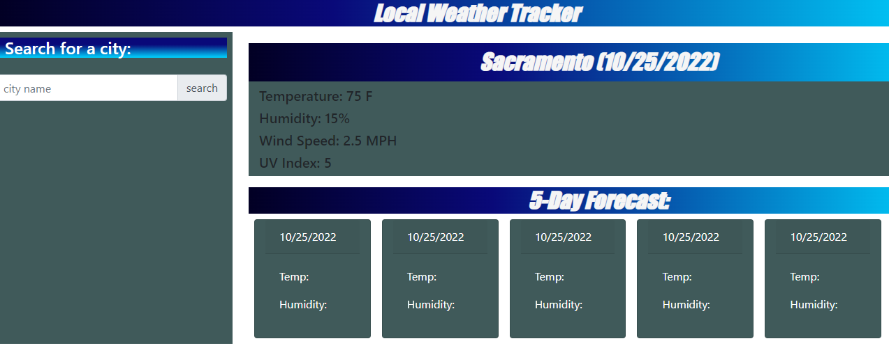

#Local Weather Application

##Description:

    An application made for daily use to stay current on the weather. Uses Javascript, Bootstrap, and JQuery.

##Uses:

    Assists in helping seeing what the current weather is for the day/week
    The application will show the current week for the weather.
    Can change the current city to check weather

Screenshot of Page

##Link: https://vtsander.github.io/localweather/